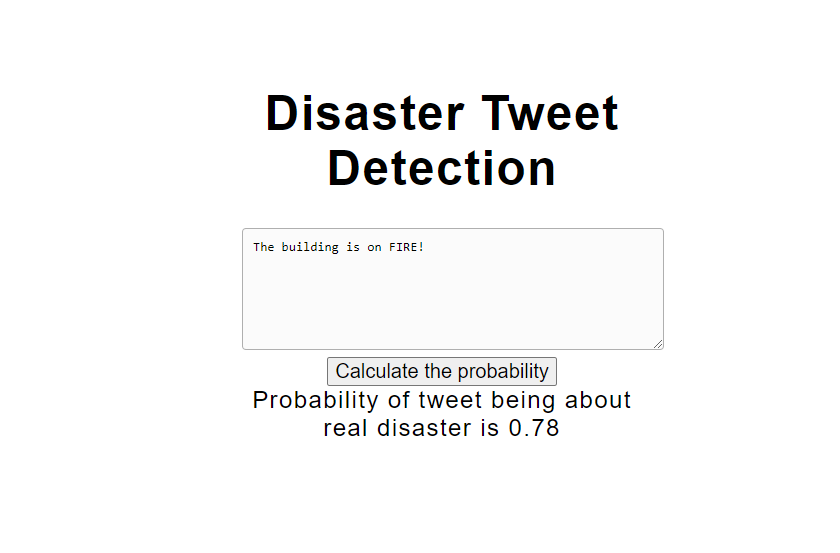

# Tweet Detection Deployment
Returns a probability of tweet being about a real disaster.

Used dataset - https://www.kaggle.com/c/nlp-getting-started/overview

Research notebook - https://github.com/ahinski/portfolio/blob/main/disaster_tweets.ipynb

## How to launch
After downloading(cloning) repo type this in command shell

    env/Scripts/activate (for Windows)
    source env/Scripts/activate (for Bash/Linux)
    
    python app.py
Then open http://127.0.0.1:5000/ in your browser.

